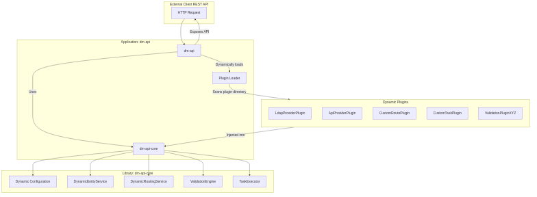
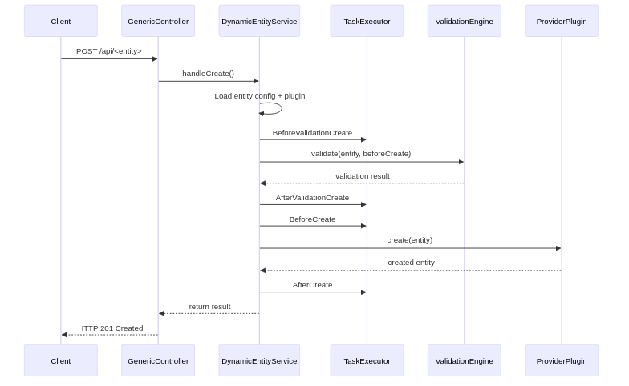

# Directory Manager API Core (`dm-api-core`)

**`dm-api-core`** is the central runtime module that provides plugin management, dynamic configuration handling, and
execution logic for the **Directory Manager** platform.

It acts as the **foundation layer** for dynamically loading, wiring, and executing external plugins, including:

* **Authorization** (e.g., RBack, Jwt, LDAP)
* **Providers** (e.g., LDAP, REST, databases)
* **Routes** (custom processing flows)
* **Tasks** (phased executions on entities)
* **Validations** (custom business rules)

## ✨ Features

* ✅ Plugin discovery and registration
* ⚙️ Dynamic entity modeling via JSON/YAML
* 🧩 Fully pluggable architecture (SPI-based)
* 🚀 Runtime execution of custom behavior (task, route, validation, etc.)
* 🔄 Decoupled from any storage/backend — behavior is defined by plugins and configuration

## 📦 Usage

This module is typically used by the runtime application [`dm-api`](../dm-api/README.md), which exposes a REST API and
loads plugins from a designated folder at startup.

You can also integrate `dm-api-core` directly into another Java application if needed.

## 🧱 Architecture Overview



Great — here's an updated **Lifecycle** section you can add to your `README.md`, clearly explaining the internal request
lifecycle and how phases are executed. It's written in a clear, developer-friendly tone in English and fits naturally
after the existing sections.

## 🔄 Request Lifecycle

The request lifecycle in **Directory Manager** is designed to be **flexible** and **extensible** via plugins. Here’s how
a request is processed internally:

### 1. 🔁 Route Dispatching

* Incoming HTTP requests are first handled by the **`GenericController`**.
* If the route is not recognized or not managed dynamically, the **`FallbackRoutingController`** takes over.
* The `FallbackRoutingController` delegates execution to a plugin-provided route, using the available `RoutePlugin`
  implementations.

### 2. ⚙️ Entity-based Action Execution

If the request targets a known dynamic entity, the `GenericController` delegates to the `DynamicEntityService`, which
orchestrates the entire processing chain.

Each standard entity action (`Create`, `Update`, `Patch`, `Delete`, `FindById`, `FindAll`) follows the same **execution
lifecycle**:

```text
-> Load entity configuration
-> Load associated ProviderPlugin
-> Execute Tasks (phase: beforeTokenValidationAction)
-> Validate token with AuthorizationPlugin
-> Execute Tasks (phase: afterTokenValidationCreate)
-> Execute Tasks (phase: beforePermissionValidationCreate)
-> Validation authorization with AuthorizationPlugin
-> Execute Tasks (phase: afterPermissionValidationCreate)
-> Execute Tasks (phase: beforeValidationAction)
-> Run validations using ValidationEngine
-> Execute Tasks (phase: afterValidationAction)
-> Execute Tasks (phase: beforeAction)
-> Perform core operation via ProviderPlugin
-> Execute Tasks (phase: afterAction)
```

Each **phase** can trigger one or more `TaskPlugin` components, giving full control to inject custom business logic at
every step of the process.

### 🧪 Lifecycle Example: `Create` Entity



## 📚 Developer Documentation

To extend the platform, you can create your own plugins by implementing the proper interfaces.

* [📄 How to create a plugin - The basics](docs/plugins/how-to-create-a-plugin.md)
* [🛡️ How to Create an Authorization Plugin](./docs/plugins/create-authorization-plugin.md)
* [🔌 How to Create a Provider Plugin](./docs/plugins/create-provider-plugin.md)
* [🛣️ How to Create a Route Plugin](./docs/plugins/create-route-plugin.md)
* [✅ How to Create a Validation Plugin](./docs/plugins/create-validation-plugin.md)
* [⚙️ How to Create a Task Plugin](./docs/plugins/create-task-plugin.md)
* [📖 Plugin Configuration Format](./docs/configuration-format.md)

## 📂 Plugin Interfaces

All plugins should implement one of the provided interfaces in the `org.linagora.linid.dmapicore.plugin` namespace:

* `AuthorizationPlugin`
* `ProviderPlugin`
* `RoutePlugin`
* `TaskPlugin`
* `ValidationPlugin`

Each plugin is automatically discovered and injected into the runtime when placed in the configured plugin directory.
