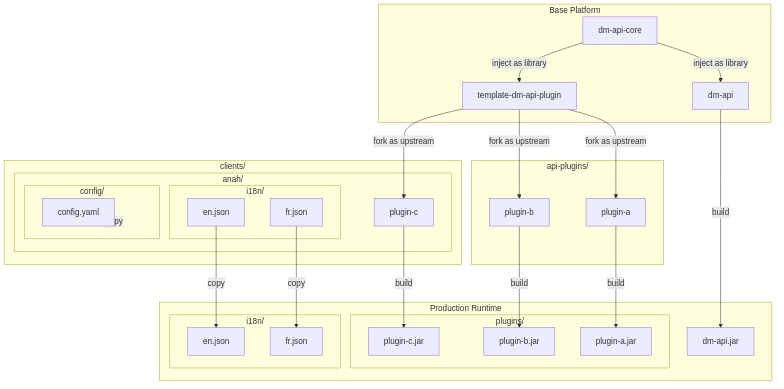

# GitLab Project Architecture - DM Platform

This document describes the organization of GitLab projects related to the DM platform, including core APIs, plugins,
client-specific projects, and templates.

## 📦 General Structure

### 🧱 Core Projects (Platform Foundation)

| Project                  | Description                                                                                           |
|--------------------------|-------------------------------------------------------------------------------------------------------|
| `dm-api-core`            | Shared Maven library. Contains common code used by both plugins and the main API.                     |
| `dm-api`                 | Main Spring Boot REST API. Uses `dm-api-core` and loads plugins dynamically.                          |
| `template-dm-api-plugin` | Backend plugin template. Provides `pom.xml`, checkstyle configuration, GitLab CI, and base structure. |

### 🔌 Plugins

| Folder         | Description                                                                                                                |
|----------------|----------------------------------------------------------------------------------------------------------------------------|
| `api-plugins/` | Contains all backend plugins for the platform, each in its own Git project. Plugins are based on `template-dm-api-plugin`. |

### 👥 Clients

| Folder          | Description                                                                                                                 |
|-----------------|-----------------------------------------------------------------------------------------------------------------------------|
| `clients/`      | Contains a folder per client. Each client folder includes their custom projects, such as:                                   |
| `clients/anah/` | Project for the Anah client. Contains the Angular frontend (multi-app), custom plugins, and deployment-ready configuration. |

## 🔁 Plugin Creation Workflow

To create a new backend plugin:

1. Create a **new GitLab project** under the `api-plugins/` group.
2. Add the `template-dm-api-plugin` as an **upstream remote**:

```bash
git remote add upstream https://gitlab.com/xxx/template-dm-api-plugin.git
git fetch upstream
git merge upstream/main
````

3. Customize the plugin according to the required functionality.
4. The plugin is picked up by `dm-api` via configuration or dynamic loading.

---

## 📊 Mermaid Diagram - GitLab Architecture



---

## 📝 Summary

* `dm-api-core`: Shared library for common logic.
* `dm-api`: Main Spring Boot API using plugins and core library.
* `template-dm-api-plugin`: Standardized template for creating backend plugins.
* `api-plugins/`: Contains all backend plugin projects.
* `clients/`: Contains all client-specific workspaces.
* `clients/anah/`: Client-specific workspace for Anah (frontend, plugins, deployment config).

This structure enables strong modularity, code reuse, and a clear separation of responsibilities between shared and
client-specific components.

```
